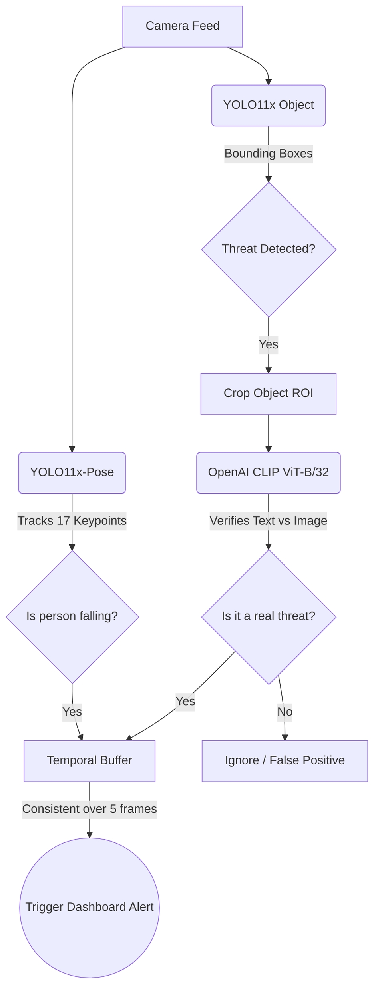

# 🛡️ Sentinel AI

> An intelligent, multi-layered cognitive surveillance system designed for high-precision threat detection.


**Sentinel AI** is a real-time computer vision project I built to go beyond standard bounding-box object detection. Most surveillance models struggle with false positives (e.g., misclassifying a phone as a weapon, or a chair as a person). By combining human skeleton tracking, zero-shot vision transformers, and temporal smoothing, this system drastically reduces false alarms while maintaining high FPS on edge hardware.

---

## ✨ Key Features

*   **Zero-Shot Threat Verification:** Integrates **OpenAI CLIP (ViT-B/32)** as a secondary verifier. When the primary detection model flags a potential weapon or hazard, the system crops the region and asks CLIP to verify the object against precise textual prompts. If CLIP disagrees, the alert is dropped.
*   **Pose-Estimation Fall Detection:** Uses **YOLO11x-Pose** to track 17 human body keypoints. Fall detection is triggered via strict spatial geometry (e.g., ankles must be visible and on the same horizontal plane as the shoulders), completely eliminating false falls from people sitting or leaning.
*   **Temporal Smoothing:** A 5-frame rolling buffer ensures that a threat must be consistently detected across multiple frames before an alert is triggered, filtering out single-frame AI glitches.
*   **TensorRT Acceleration:** The architecture is optimized to run heavy models (YOLO11x + Pose + ViT) smoothly by utilizing CUDA and NVIDIA TensorRT compilation for local GPUs.
*   **Real-Time Dashboard:** A responsive web interface built with Flask and WebSockets for live video streaming, real-time threat logging, and system telemetry.

---

## 🧠 How It Works (The Pipeline)

The system processes video feeds through a dual-model, multi-stage pipeline:



---

## 💻 Tech Stack

*   **Computer Vision:** OpenCV, Ultralytics (YOLO11), ByteTrack
*   **Deep Learning:** PyTorch, HuggingFace Transformers (CLIP)
*   **Hardware Acceleration:** CUDA 12.1, NVIDIA TensorRT
*   **Backend:** Python, Flask, Flask-SocketIO (WebSockets)
*   **Frontend:** HTML5, Vanilla JS, Chart.js

---

## ⚙️ Local Setup & Installation

### Prerequisites
*   Python 3.12+
*   NVIDIA GPU (Tested on RTX 4050 6GB) with CUDA Toolkit 12.1 installed.

### Installation

1. **Clone the repository:**
   ```bash
   git clone https://github.com/Siddhantkr07/DL-Project.git
   cd DL-Project
   ```

2. **Install dependencies:**
   ```bash
   pip install -r requirements.txt
   ```
   *(Note: Ensure you install the CUDA-enabled version of PyTorch if setting up a fresh environment).*

3. **Launch the Server:**
   ```bash
   python dashboard/app.py
   ```

4. **Access the Dashboard:**
   Open your browser and navigate to `http://127.0.0.1:5000`.

---

## 🗺️ Roadmap

- [x] Integrate YOLO11x and YOLO11x-Pose
- [x] Implement Temporal Smoothing Buffer
- [x] Add Zero-Shot Verification (OpenAI CLIP)
- [x] Build Real-Time Web Dashboard
- [ ] Add support for multiple concurrent RTSP IP camera streams
- [ ] Implement email/SMS notifications for CRITICAL alerts
- [ ] Add historical incident database & playback

---

*Built by [Siddhant Kumar](https://github.com/Siddhantkr07)*
